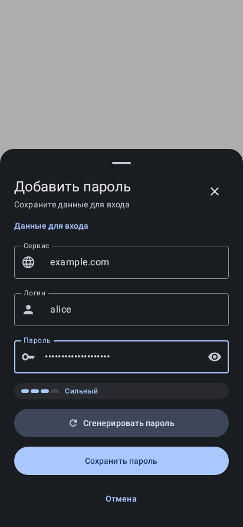

# Decryptum

**Your passwords. Your keys. Your device.**

A local-first Android password manager and TOTP authenticator, built with Kotlin, Jetpack Compose and Material 3. No Decryptum account or hosted vault is required.

[Русский](README.ru.md) · [Українська](README.uk.md) · [Releases](https://github.com/Doffi4/Decryptum/releases) · [Security](SECURITY.md) · [Privacy](PRIVACY.md)

**Status: v1.1.0 public prerelease, active development.** This README describes the current source, including local Security Center work. Existing APKs may differ. Passkeys are experimental; Claude guidance is debug-only and disabled in release. Keep independent recovery options and test with disposable data while [launch gates](docs/PHASE6_HANDOFF.md) remain open.

**[Download v1.1.0 prerelease](https://github.com/Doffi4/Decryptum/releases/tag/v1.1.0)** · versionCode 7 · 2026-10-08. [What changed](docs/RELEASE_NOTES_1.1.md), [artifact verification](docs/BUILD_VERIFICATION_1.1.md), [remaining gates](docs/LAUNCH_CHECKLIST.md).

## A look at the app

| Vault | TOTP authenticator |
| --- | --- |
|  |  |

Existing screenshots of an earlier interface, **not current-build captures**. Exact capture provenance is unverified; displayed entries are not usage statistics. Current Material Privacy fallback colors and Security Center are not pictured. See [screenshot notes](docs/screenshots/README.md).



New password-entry sheet: actual Compose component rendered locally with synthetic data through Robolectric, **not a physical-device screenshot**.

## What is implemented

- Local account vault: add/edit/delete, search, service grouping, master-password unlock and a supported biometric flow.
- SecureRandom password generator with configurable length and character sets.
- Local TOTP (SHA-1/256/512), manual/QR input, QR image decoding and Google Authenticator migration parsing.
- Android Autofill Framework, inline suggestions and save/choose flows; Android 14+ Credential Provider code. Device/browser compatibility and recipient authorization need validation.
- **Local Security Center:** weak-password heuristic, exact cross-account reuse and duplicate review. No automatic changes, global safety score or remote breach check.
- **Experimental passkeys:** software P-256/ES256 creation/assertion implementation and local management. Exportable private keys, not hardware-bound credentials; protocol/caller trust and recovery remain gates.
- CSV/JSON import parsers and **unencrypted CSV export**. Export can contain passwords, TOTP seeds and private passkey material; it is not a portable encrypted backup.
- Optional aggregate-only Claude Security Advisor experiment, configured at runtime in debug only, with consent for every request. Release factory disables it.

Android **8.0+ / API 26**; Credential Provider/passkeys require **Android 14+ / API 34**. App languages: **English and Russian**. No cloud sync, iOS/browser/desktop vault client or Ukrainian app strings are implemented. A [static landing website](website/README.md) is prepared locally; it is not a web vault.

## Security and privacy

Room/SQLCipher encrypts the database with a random Keystore-wrapped database key. Password/TOTP fields and private passkey bytes use AES-GCM with a separate vault key wrapped by an Argon2id master-password-derived key. Biometrics provide an alternate DEK unlock path. Hardware properties and native behavior need device verification.

Core features work offline, but favicon requests can disclose service domains to external providers. HIBP range-query code remains in the tree and is **not connected** to current loading/edit/Security Center checks. Breaches are not checked. No analytics or remote crash-reporting SDK was found in current app source/dependencies.

The debug advisor sends only four counts, never passwords/secrets/hashes or account identities; IP/timing and provider metadata still leave the device. It is disabled in release. Android backup is disabled and complete encrypted recovery is not established. Uninstall, device/Keystore loss or a forgotten master password can make data unrecoverable.

Read [Security](SECURITY.md), [Privacy](PRIVACY.md) and [Threat Model](docs/THREAT_MODEL.md). No independent audit, zero-knowledge, guaranteed memory erasure or proven WebAuthn compliance is claimed.

## Try or build

Download the approved **[v1.1.0 APK](https://github.com/Doffi4/Decryptum/releases/download/v1.1.0/Decryptum-v1.1.0.apk)** and review the [release notes](docs/RELEASE_NOTES_1.1.md). This is the owner-reviewed versionCode 7 candidate, published without rebuilding. It shares the Android Debug certificate with v1.0.1; native upgrade/data retention remains untested. Do not uninstall or reset an important vault to force an update.

Build with Android Studio/SDK 37 and a JDK 25 Gradle runtime. The checked-in wrapper uses Gradle 9.6.0; Java source compatibility is 11. Set local SDK location in ignored local.properties.

```powershell
# Windows example: choose your installed JDK path.
$env:JAVA_HOME='E:\Android Studio\jbr'
.\gradlew.bat :app:testDebugUnitTest :app:assembleDebug :app:lintDebug --console=plain
```

Debug output normally appears in app/build/outputs/apk/debug/. Disposable emulator/device tests: :app:connectedDebugAndroidTest. Compilation does not verify Android runtime behavior. See [Contributing](CONTRIBUTING.md). Local website: cd website, npm ci, npm run build, npm run preview.

## Next priorities

Close integration authorization and crash-safe migration gates; establish complete encrypted recovery; validate passkeys, native storage and device UX; prepare a production signing policy and validated device release. Better import diagnostics and consented HIBP are later work. Sync and browser/desktop clients are future exploration. See [Product & roadmap](docs/PRODUCT.md) and [Phase 6](docs/PHASE6_HANDOFF.md).

## Contribute and disclose

[Contributing](CONTRIBUTING.md) explains focused changes and checks. Use synthetic data and reviewed/redacted evidence. Follow [responsible disclosure](SECURITY.md#reporting-a-vulnerability); a private channel still needs owner confirmation, so do not post secrets or exploit details publicly.

Licensed under [GNU GPLv3](LICENSE).
