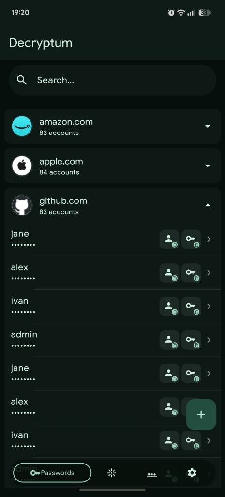
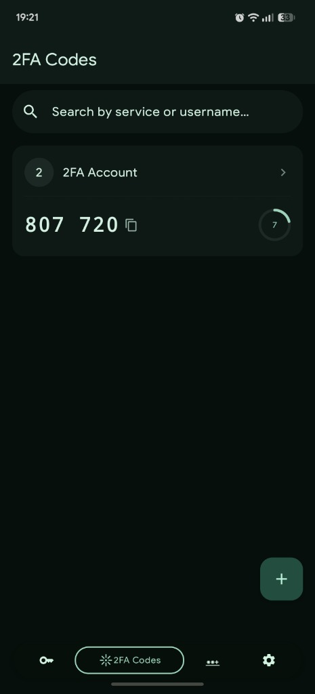
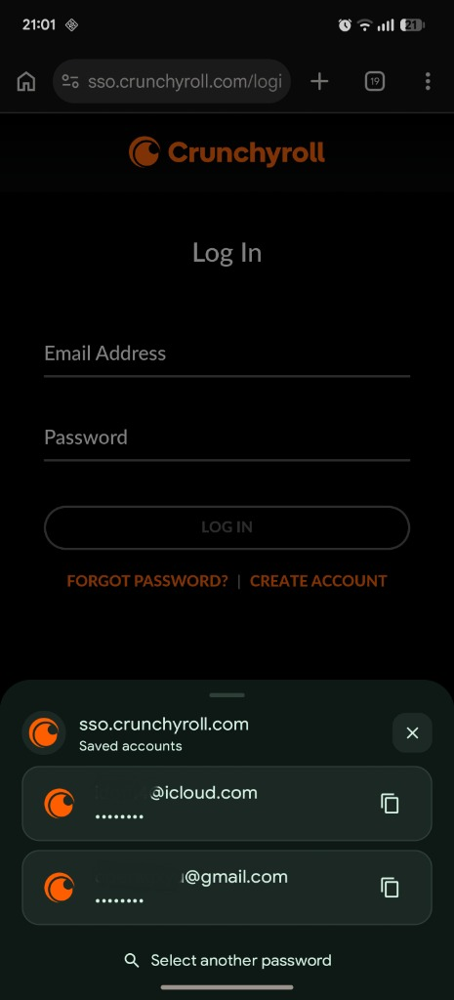

# Decryptum

Offline password manager and 2FA authenticator for Android with system autofill integration and Passkey support.

[English] | [Українська](README.uk.md) | [Русский](README.ru.md)

[-green.svg?style=flat-square)](https://developer.android.com)

## Screenshots

| Vault | 2FA Authenticator | Autofill Bottom Sheet |
|:---:|:---:|:---:|
|  |  |  |

## Features

### Core Vault & Encryption
- Full-database AES-256 encryption via SQLCipher (`sqlcipher-android`) with page-level encryption.
- Master password derivation using memory-hard Argon2id (RFC 9106) via `argon2kt`.
- Hardware-backed DEK wrapping using Android Keystore AES-GCM (`enc:2:...`).
- Biometric authentication (`BiometricPrompt`) with configurable auto-lock intervals.
- Automatic clipboard clearing after 30 seconds via `AlarmManager` and `EXTRA_IS_SENSITIVE` flag on Android 13+.
- Offline CSV export and import compatible with Bitwarden, KeePass, Chrome, and LastPass.
- HaveIBeenPwned k-Anonymity API integration for checking compromised passwords (zero knowledge, 5-char SHA-1 prefix query).

### Passkeys / WebAuthn
- FIDO2 / WebAuthn passkey registration and authentication via Android Credential Manager API.
- Hardware-backed ECDSA P-256 (secp256r1) key generation stored in Android Keystore.
- Native CBOR encoding and decoding for authenticator data and client data JSON processing.
- Direct inspection and management of registered passkeys per account.

### 2FA / TOTP Authenticator
- Time-based one-time password generator (RFC 6238) supporting HMAC-SHA1, HMAC-SHA256, HMAC-SHA512.
- Configurable token length (6 or 8 digits) and step intervals (30 or 60 seconds).
- Real-time countdown timer with progress bar and one-tap clipboard copy.
- Live camera QR code scanner via CameraX and Google ML Kit Barcode Scanning.
- QR image import from device storage via ZXing fallback.
- Batch account migration import from Google Authenticator export URIs (`otpauth-migration://`).

### Android Integration
- Native `AutofillService` implementation for browsers (Chrome, Firefox, Brave) and native applications.
- Inline keyboard suggestions (IME chips) for Gboard and compatible keyboards.
- Android 14+ Credential Provider integration (`DecryptumCredentialProviderService`).
- Form structure parser (`AutofillStructureParser`) preventing suggestions in chat inputs and search fields.
- In-app credential save flow (`AutofillSaveActivity`) when entering new accounts.
- Per-app language support (English, Ukrainian, Russian) via Android 13+ `LocaleManager`.
- Optional `FLAG_SECURE` window protection against screenshots and app switcher previews.

## Tech Stack

- **Language:** Kotlin 2.2.10 (Target SDK 37, Min SDK 26)
- **UI:** Jetpack Compose, Material 3, Navigation Compose
- **Database:** Room 2.8.4 + SQLCipher 4.6.1
- **Cryptography:** Argon2kt 1.6.0, AndroidX Security Crypto, Android Keystore
- **Credentials & Autofill:** AndroidX Credentials 1.5.0, Android Autofill Framework
- **2FA & Vision:** CameraX 1.4.1, Google ML Kit Barcode Scanning 17.3.0, ZXing Core 3.5.3
- **Dependency Injection:** Koin 3.5.0
- **Image Loading:** Coil 2.7.0 (local ICO parser + disk caching)
- **Code Shrinker:** ProGuard / R8 with baseline profiles

## Installation

Download the signed APK from the [GitHub Releases](https://github.com/Doffi4/Decryptum/releases) page:
- `Decryptum-v1.0.0-release.apk` - Optimized production build.
- `Decryptum-v1.0.0-debug.apk` - Debug build with logs and diagnostics.

## License

This project is licensed under the terms of the GNU General Public License v3.0 (GPLv3). See [LICENSE](LICENSE) for details.
